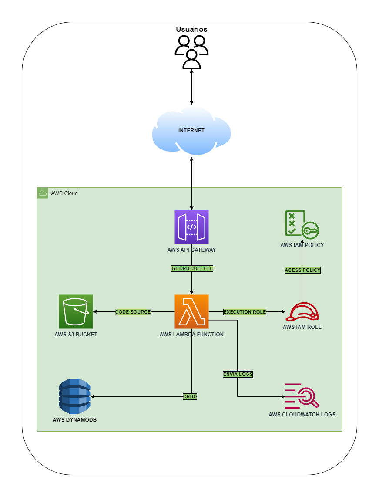
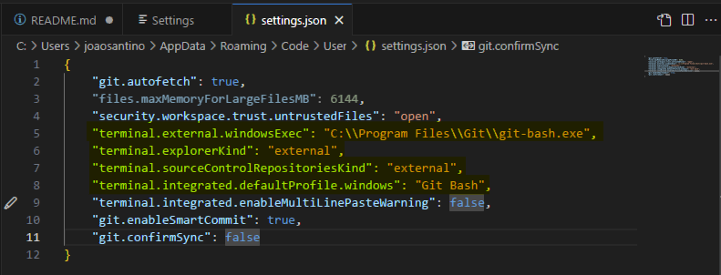
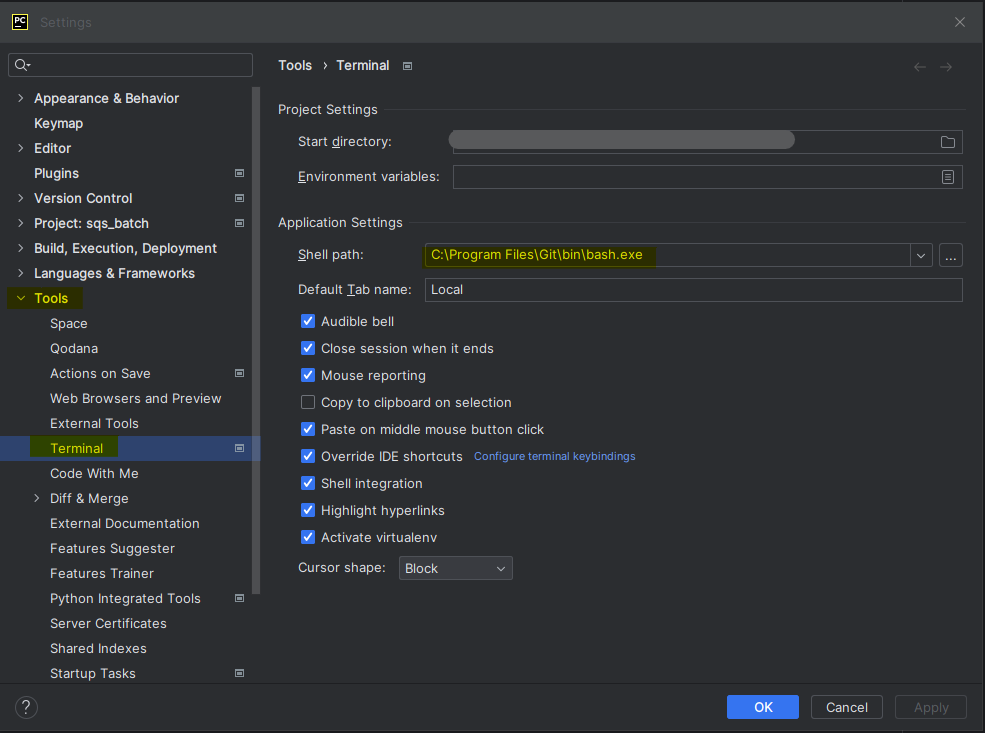
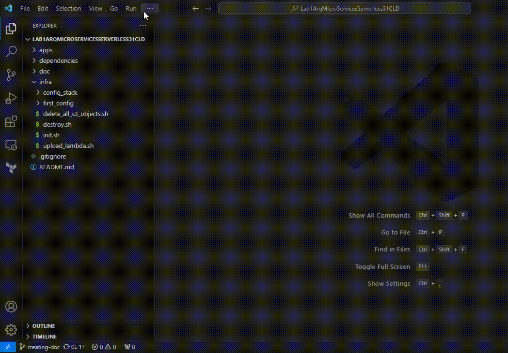
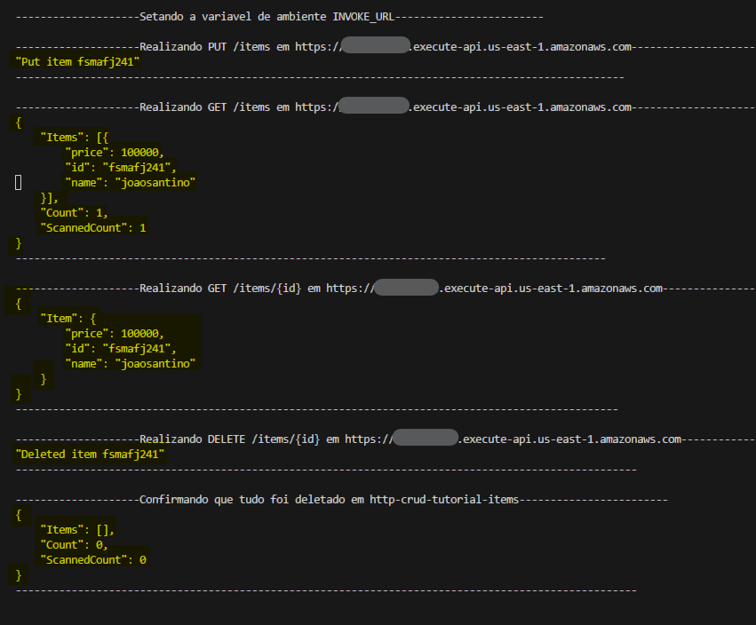
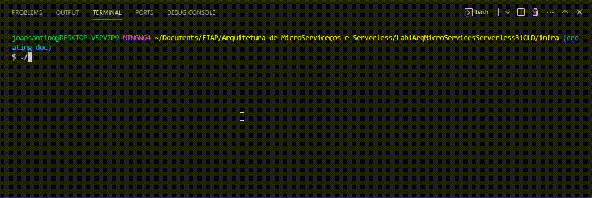

## Laboratório 1 de Arquitetura de MicroServices and Serverless Turma 31CLD
Repositório contendo todo o conteudo do 
[Laboratório 1](https://catalog.us-east-1.prod.workshops.aws/workshops/2c8321cb-812c-45a9-927d-206eea3a500f/en-US/000-gettingstarted) da matéria Arquitetura Microservices e Serverless. O laboratório consiste em provisionar uma aplicação

Neste laboratório será realizada a criação de alguns serviços Serverless na AWS, como o **AWS API Gateway** em modo HTTP API, uma aplicação em NodeJs 14x em uma **AWS Lambda Function** e uma base de dados NOSQL no **AWS DynamoDB**. Como complemento ao funcionamento deste laboratório, também será provisionado recursos auxiliares para o correto funcionamento de toda a infraestrutura, como o serviço de armazenamento de objetos **AWS S3**, criação de Policies e Roles no **AWS IAM**, que posssibilita o permissionamento e que serviços assumam funções e assim possam se integrar e modificar o comportamento em outros serviços. Nossa aplicação também salvará logs no **AWS CloudWatch Logs**.

Todo o conteudo será provisionado utilizando o Terraform e algumas automações foram realizadas para otimizar a criação e exclusão destes recursos na Cloud AWS. Recomenda-se seguir todos os passos deste README para a configuração da sua conta AWS, da sua AWS API Crendentials execução do instalador de dependências criado exclusivamente para este laboratório.

## Arquitetura da solução
Conforme contextualizado anteriormente, esta arquitetura consiste nos seguinte serviços:
- AWS API Gateway
- AWS Lambda Function
- AWS Dynamo DB
- AWS CloudWatch Logs
- AWS S3
- AWS IAM Policy/Role

<h5 align="center">Arquitetura da solução</h5>

## Dependências
Estas serão as dependências utilizadas por toda a infraestrutura. Recomendo que instale somente o que não tiver em sua máquina, caso não tenha nenhuma das dependências, **utilize o instalador criado exclusivamente para este laboratório, otimizará seu tempo.**

- [JQ](https://jqlang.github.io/jq/download/)
- [Node](https://nodejs.org/pt-br/download)
- [7zip](https://www.7-zip.org/)
- [Gitbash](https://git-scm.com/downloads)
- [Terraform](https://developer.hashicorp.com/terraform/downloads)
- [AWS CLI 2.0](https://docs.aws.amazon.com/cli/latest/userguide/getting-started-install.html)
- [Visual Studio Code](https://code.visualstudio.com/download) (ou seu IDE preferido)

## Como rodar
### -> Instalação de dependências:
Após realizar o clone do repositório na sua máquina, vá até a pastadependencies/ e procure pela primeira parte do arquivoInstalar_Dependencias_v1.zip e realize a extração do mesmo.

Após extração, execute o arquivo Instalar_Dependencias_v1.exe, o mesmo iráinstalar todas as dependências informadas no tópico anterior. 

Reinicie seu computador para que as variáveis de ambiente sejam aplicadas.

### -> Configuração do ambiente:
Neste passo, você já terá todas as dependências funcionais para este laboratório. Abra o IDE de sua preferência, contanto que o terminal Default da sua IDE seja o GitBash, caso não tenha essa configuração veja nas imagens abaixo como fazer.

<h5 align="center">Configurando o Microsoft Visual Studio Code com o terminal default sendo o GitBash</h5>

<h5 align="center">Configurando o JetBrains IDE PyCharm com o terminal default sendo o GitBash.</h5>
    
    
Note que as IDE's da JetBrains seguem os mesmos conceitos, logo se você usa o WebStorm ou IntelliJ IDEA, você seguirá o mesmo passo.
    
Agora navegue pelo terminal em seu IDE até a pasta infra utilizando o comando:
    
    -> cd /infra

E execute o comando:

    -> ./init_sh

Conforme GIF abaixo.

<h5 align="center">Execução do script init.sh</h5>

Fique atento ao terminal, pois diversas vezes será solicitada a interação do usuário!
    
Após todos os recursos terem sido criados, será enviado para o API Gateway provisionado nesta ordem as seguintes requisições:

    - PUT /items
    - GET /items
    - GET /items/{id}
    - DELETE /items/{id}
    
E esta deve ser a saída final do script init.sh

<h5 align="center">Final da execução do script init.sh</h5>

Para realizar a deleção de todos os recursos em sua conta AWS você deve executar o comando abaixo:
        
    -> ./destroy.sh
    
O mesmo irá solicitar uma confirmação sua, então é necessário interagir com o terminal. Abaixo temos um GIF mostrando a execução do script de destruição dos recursos.

<h5 align="center">Execução do script destroy.sh</h5>

Para ver como deve ser a saída correta de ambos os scripts executados acima, execute estes comandos em seu terminal:

    ->  cat doc/scripts_output/init.log
    ->  cat doc/scripts_output/destroy.log

Desta forma, o conteúdo do arquivo estará exatamente igual ao do seu terminal, abrindo-o pelo IDE você verá caracteres especiais que indicam alguma cor para o terminal e utilizando o comando cat você verá a saída do script corretamente.

### FIM
Caso encontre erros de escrita e ou do processo de execução, favor entrar em contato pelo [Linkedin](https://www.linkedin.com/in/joaosantino/).